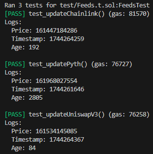

# EVM Feeds 

Contains a single smart contract with a list of onchain pricefeeds.

- [Chainlink](https://chain.link/)
- [Uniswap V3](https://docs.uniswap.org/contracts/v3/overview)
- [Pyth](https://www.pyth.network/)

## Quickstart

Clone the repo

```shell
git clone 
```

Run the tests on a mainnet fork (you'll need your own API key)

```shell
forge test -vvv --fork-url https://eth-mainnet.g.alchemy.com/v2/<YOUR_API_KEY>
```

You should see a list of prices and timestamps for each onchain pricefeed.




## Feeds.sol

- `update()` - Allows anyone to update the `latestETHPrice` using a pricefeed from the list.
- `viewPrice()` - Allows anyone to view the `latestETHPrice` and the timestamp at which it was last updated.

### Chainlink

Simple to implement, all you need is the [pricefeed contract address](https://docs.chain.link/data-feeds/price-feeds/addresses) and an [AggregatorV3Interface](https://github.com/smartcontractkit/chainlink/blob/develop/contracts/src/v0.8/shared/interfaces/AggregatorV3Interface.sol).

Once you have both of these, you can call `latestRoundData()` to get the price.

```solidity
function latestRoundData() external view returns (uint80 roundId, int256 answer, uint256 startedAt, uint256 updatedAt, uint80 answeredInRound);
```

The price, `answer`, is returned as an `int256`. To find out how many decimals the price has, you can use the `decimals()` function that is included in the interface.

### Uniswap V3

This repo uses the straightforward `slot0()` function to retrieve the latest price in the form of a [Q64.96](https://docs.uniswap.org/contracts/v3/reference/core/libraries/FixedPoint96) value. Note there are [alternative options](https://docs.uniswap.org/concepts/protocol/oracle#deriving-price-from-a-tick) to retrieve and calculate prices based on multiple [ticks](https://docs.uniswap.org/concepts/glossary#tick).

```solidity
  function slot0() external view returns (
        uint160 sqrtPriceX96, 
        int24 tick, 
        uint16 observationIndex, 
        uint16 observationCardinality, 
        uint16 observationCardinalityNext, 
        uint8 feeProtocol, 
        bool unlocked
    )
```

The price, `sqrtPriceX96`, is returned as a `uint160` variable. To make the price fit our shared 8 decimal format, we can convert the number from Q64.96 into a regular integer. Then, since the price is in terms of 1 USDC to WETH, we calculate the inverse value to get the USDC value of 1 WETH.

```solidity
uint256 flippedPrice = (sqrtPriceX96 >> 96) ** 2;    
uint price = (1e20 / (flippedPrice));
```

We also pass the `observationIndex` to the `observations()` function to retrieve the timestamp at which the price was stored.

```solidity
(uint32 timestamp,,,) = pool.observations(index);
```


### Pyth

Instead of following the [guide](https://docs.pyth.network/price-feeds/use-real-time-data/evm#write-contract-code) in the documentation, which involves using their offchain web service called [Hermes](https://docs.pyth.network/price-feeds/how-pyth-works/hermes) to update the onchain price, we use the less secure `getPriceUnsafe()` method.

```solidity
struct Price {
        int64 price;
        uint64 conf;
        int32 expo;
        uint publishTime;
    }

function getPriceUnsafe(bytes32 id) external view returns (PythStructs.Price memory price);
```

Statement from the [Pyth documentation](https://docs.pyth.network/price-feeds/troubleshoot/evm#getprice-reverts-with-staleprice-or-0x19abf40e-error):

     NOTE: getPriceUnsafe() method does not check the freshness of the price.